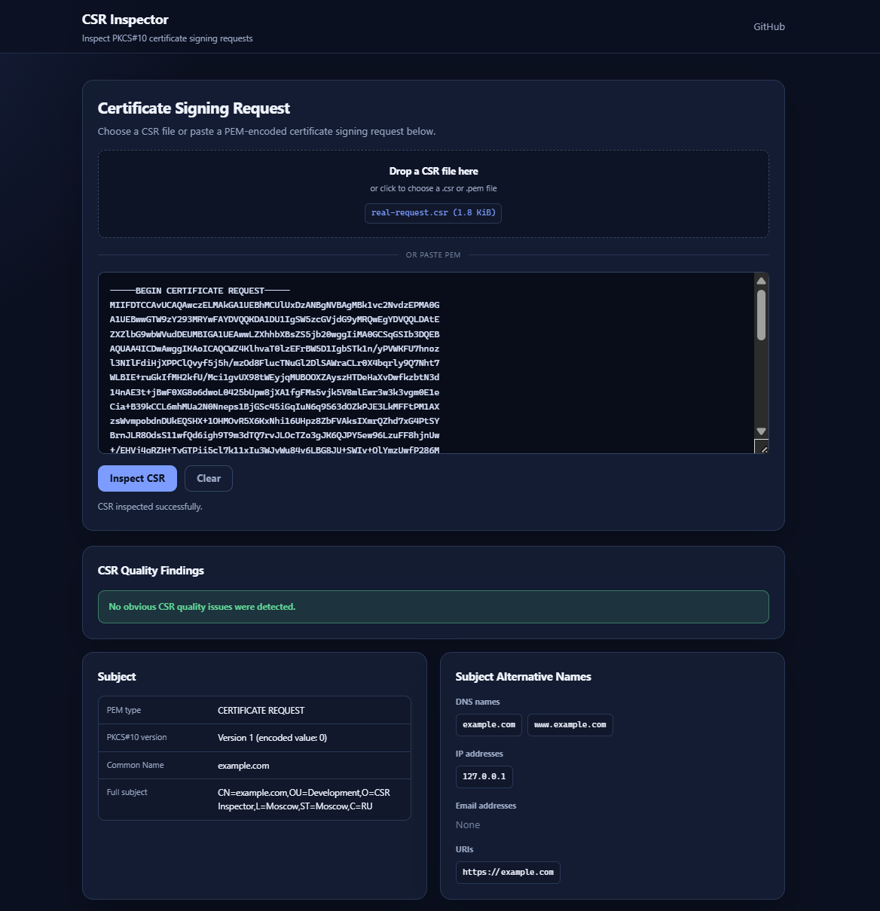

# CSR Inspector

[](https://github.com/DmitriyVypovskoi/csr-inspector/actions/workflows/ci.yaml)

A lightweight web application for inspecting, validating, and analyzing PKCS#10 certificate signing requests.

CSR Inspector displays the request subject, Subject Alternative Names, public key information, requested extensions, signature algorithm, self-signature status, and potential quality or compatibility issues.

The application is written in Go and uses only the standard browser APIs on the frontend.




## Features

* Paste a PEM-encoded CSR directly into the browser.
* Upload `.csr`, `.pem`, or text files.
* Drag and drop CSR files into the page.
* Parse PKCS#10 request fields.
* Display the full distinguished name and individual RDN attributes.
* Display DNS names, IP addresses, email addresses, and URIs from SAN.
* Show public key algorithm, size, parameters, and SHA-256 fingerprint.
* Verify the CSR self-signature when the algorithm is supported.
* Display requested X.509 extensions.
* Detect common CSR quality and compatibility issues.
* Provide structured JSON output.
* Copy parsed JSON to the clipboard.
* Reject certificates, private keys, malformed PEM, and unexpected trailing data with clear messages.

## CSR quality findings

CSR Inspector currently detects several common problems:

* RSA keys smaller than 2048 bits.
* Critically small RSA keys that cannot be verified by modern Go versions.
* MD5 or SHA-1 signature algorithms.
* Missing Subject Alternative Name extension.
* Common Name values that are not included in SAN.
* Duplicate SAN entries.
* IP addresses encoded as DNS SAN values.
* Unusual or incorrectly positioned wildcard characters.
* Empty Subject fields.
* Unknown PKCS#10 version values.

Findings are separate from parser warnings.

A finding describes a potential issue with the CSR itself. A warning describes a technical limitation of the inspector, such as an unsupported signature verification algorithm.

## Supported algorithms

| Algorithm             |               Parsing | Self-signature verification |
| --------------------- | --------------------: | --------------------------: |
| RSA                   |                   Yes |                         Yes |
| ECDSA                 |                   Yes |                         Yes |
| Ed25519               |                   Yes |                         Yes |
| DSA                   |                   Yes |   Yes, when supported by Go |
| GOST R 34.10-2012-256 |               Partial |   Not currently implemented |
| Unknown algorithms    | Partial ASN.1 parsing |                          No |

For unsupported algorithms, CSR Inspector attempts to preserve and display as much useful ASN.1 information as possible.

An unsupported verification algorithm is shown as **Not verified**, not **Invalid**.

## PKCS#10 version

PKCS#10 certificate requests normally contain an encoded version value of `0`.

The interface displays this as:

```text
Version 1 (encoded value: 0)
```

The raw JSON response preserves the original encoded value.

## Privacy and security

A CSR contains a public key, not a private key. However, it may still include sensitive internal information such as:

* private DNS names;
* internal IP addresses;
* organization names;
* email addresses;
* infrastructure naming conventions.

CSR Inspector is designed with the following protections:

* Request bodies are not intentionally written to application logs.
* Parsed CSR contents are not intentionally persisted.
* Responses use `Cache-Control: no-store`.
* Request body size is limited.
* HTTP server read and write timeouts are configured.
* Security headers are added to responses.
* Content Security Policy restricts browser resources to the same origin.
* Panics are recovered without exposing stack traces to users.
* Private key PEM blocks are rejected with a warning.
* Detailed internal ASN.1 and Go errors are not returned to the browser.

When a file is selected, the browser reads it locally. Its contents are sent to the application backend only after the user clicks **Inspect CSR**.

Do not submit private keys to this or any other public inspection service.

## Running locally

### Requirements

* Go version specified in `go.mod`
* Git
* Node.js is optional and is only used for JavaScript syntax checks

Clone the repository:

```bash
git clone https://github.com/DmitriyVypovskoi/csr-inspector.git
cd csr-inspector
```

Download dependencies:

```bash
go mod download
```

Run the application:

```bash
go run ./cmd/server
```

The server writes its listening address to the application log.

Open that address in a browser, for example:

```text
http://localhost:8080
```

## Local checks

Format the Go code:

```bash
gofmt -w .
```

Verify module files:

```bash
go mod tidy
```

Run static analysis:

```bash
go vet ./...
```

Run tests:

```bash
go test ./...
```

Run tests with the race detector:

```bash
go test -race ./...
```

Build the server:

```bash
go build ./cmd/server
```

Check the frontend JavaScript syntax:

```bash
node --check web/static/app.js
```

Run the Go vulnerability scanner:

```bash
go install golang.org/x/vuln/cmd/govulncheck@latest
govulncheck ./...
```

## Continuous integration

The GitHub Actions workflow runs automatically for pushes and pull requests.

The CI pipeline performs:

* `go mod tidy` verification;
* Go formatting verification;
* `go vet`;
* tests with the race detector;
* application build;
* frontend JavaScript syntax validation;
* vulnerability scanning with `govulncheck`.

The workflow is located at:

```text
.github/workflows/ci.yaml
```


The frontend files are embedded into the Go binary with `go:embed`. The deployed application therefore requires only a single executable and does not need a separate static file server.

## How it works

CSR Inspector performs parsing in two stages.

First, it decodes the generic ASN.1 PKCS#10 structure. This allows the application to extract basic information even when the cryptographic algorithm is not supported by Go's `crypto/x509` package.

Second, supported requests are parsed using `crypto/x509`, and their self-signatures are verified using the public key contained in the CSR.

A valid self-signature confirms that the request was signed by the private key corresponding to the public key inside the CSR. It does not prove:

* ownership of a domain;
* identity of the requester;
* trust in an organization;
* approval by a certificate authority;
* future certificate validity.

## Error handling

The application distinguishes between several input errors:

* empty request;
* invalid PEM encoding;
* incorrect BEGIN or END boundaries;
* unsupported PEM type;
* certificate submitted instead of a CSR;
* private key submitted instead of a CSR;
* additional PEM headers;
* unexpected data after the CSR;
* malformed PKCS#10 ASN.1 structure;
* request body exceeding the configured size limit.

User-facing messages do not expose internal stack traces or low-level parser errors.

## Current limitations

* GOST public key details are parsed only partially.
* GOST self-signature verification is not implemented.
* The application currently inspects certificate signing requests only.
* Certificate inspection is planned but not yet available.
* The quality analyzer provides guidance and does not replace certificate authority policy validation.
* Some certificate authorities may apply requirements that are more restrictive than the checks implemented here.

## Roadmap

* Expand automated parser tests using real CSR fixtures.
* Add certificate inspection.
* Add additional CSR linting rules.
* Improve support for uncommon extensions and attributes.
* Add Docker packaging.
* Publish a hosted version.
* Add deployment automation.
* Add optional request rate limiting for public deployments.
* Revisit GOST signature verification if there is sufficient user demand.

## Contributing

Issues and pull requests are welcome.

When submitting a change:

1. Keep parser behavior deterministic.
2. Do not log CSR request bodies.
3. Add tests for new parsing or finding rules.
4. Run the local checks before opening a pull request.
5. Keep user-facing errors independent from internal Go error messages.

For security-sensitive issues, avoid publishing private keys, production CSRs, internal domain names, or other confidential infrastructure details in public issues.
